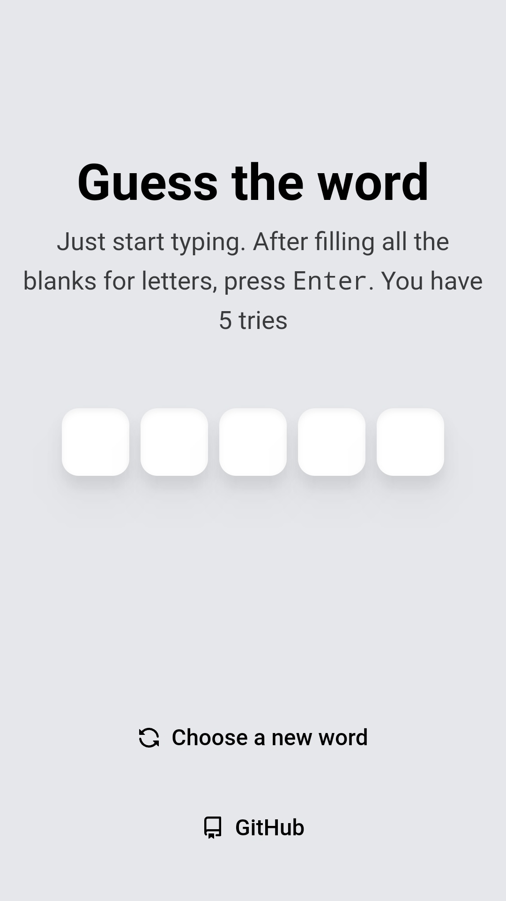

# Word Guessing Game

A word guessing game similar to Wordle

## Screenshots



## Development

### Prerequisites

- Node.js
- Git

### Setup

1. Clone the repository

```bash
git clone https://github.com/ivteplo/word-guessing-game
```

2. Navigate to the folder

```bash
cd word-guessing-game
````

3. Install dependencies

```bash
npm install
```

4. Start the development server

```bash
npm run dev
```

5. Open `localhost:3000`

6. Happy hacking! ✨

